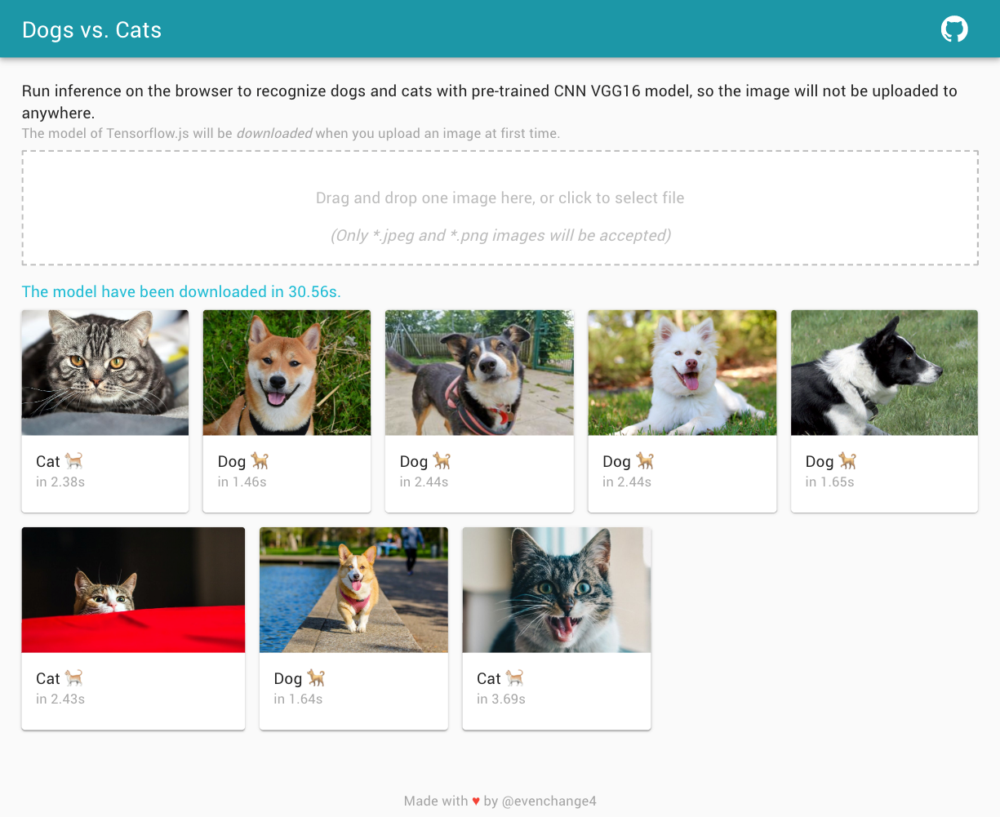
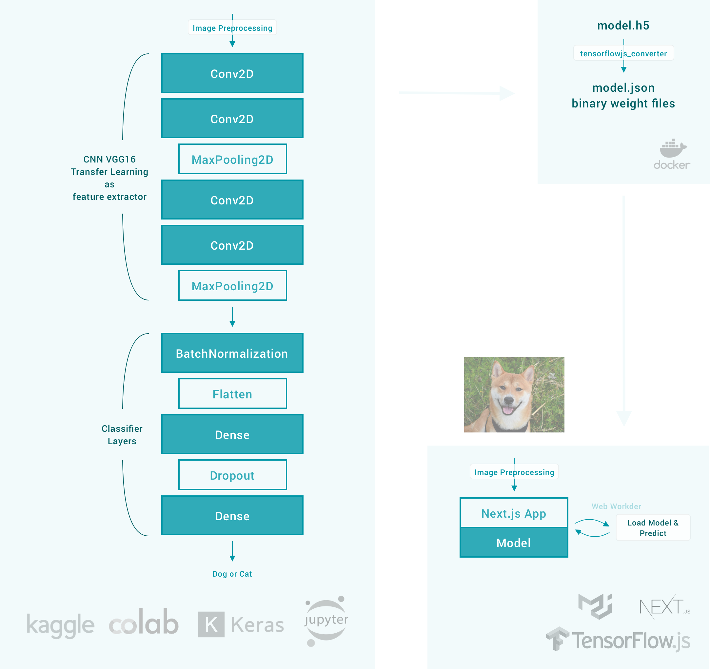

# Next.js Tensorflow.js CNN

> 🐕 🐈 Classifier using Keras VGG16 transfer learning with kaggle dogs vs. cats dataset.
>
> Further reading: [中文 Inference on the Browser with Tensorflow JS](https://medium.com/@evenchange4/inference-on-the-browser-with-tensorflow-js-c7b4de863a2a)



<table>
  <tr>
    <th>Input data type</th>
    <th>Task type</th>
    <th>Model type</th>
    <th>Training</th>
    <th>Inference</th>
    <th>Save-load operations</th>
  <tr>
    <td>Image</td>
    <td>Multiclass classification (transfer learning)</td>
    <td>Convolutional neural network</td>
    <td>Python</td>
    <td>Browser</td>
    <td>Export trained model from Keras and load it in browser</td>
  </tr>
</table>



## Training

Use [Jupyter Notebook](./python/vgg16.ipynb) to [save Keras models](https://keras.io/getting-started/faq/#how-can-i-save-a-keras-model) as HDF5 file to `./python/output/model.h5`

## Convert to model of Tensorflow.js

Use [tfjs-converter](https://github.com/tensorflow/tfjs/tree/master/tfjs-converter) to convert the model format via docker image under `./python/output/model-tfjs/`:

```bash
$ docker run -it --rm \
  -v "$PWD/python:/python" \
  evenchange4/docker-tfjs-converter \
  tensorflowjs_converter --input_format=keras model.h5 python/output/model-tfjs
```

> Python 3.6.8 Tensorflowjs 1.2.6 keras 2.2.4-tf tensorflow 1.14.0

## Client side

### Install

```bash
yarn install --pure-lockfile

# move model to static folder
# cp -r python/output/model-tfjs static
```

### Develop

- node 12.10.0
- yarn 1.17.3

### Deploy

Any commits pushed to master branch.

### Changelog

```bash
npm run changelog
```

### Test

```bash
$ yarn run format
$ yarn run eslint
$ yarn run type-check
$ yarn run test:watch
```

---

## CONTRIBUTING

- ⇄ Pull requests and ★ Stars are always welcome.
- For bugs and feature requests, please create an issue.
- Pull requests must be accompanied by passing automated tests (`$ yarn run test`).

## [CHANGELOG](CHANGELOG.md)

## [LICENSE](LICENSE)

## Reference

- [Keras CNN Dog or Cat Classification](https://www.kaggle.com/uysimty/keras-cnn-dog-or-cat-classification)
- [VGG16-with-TensorflowJs](https://github.com/himanshu987/VGG16-with-TensorflowJs)
- [TensorFlow.JS — Using JavaScript Web Worker to Run ML Predict Function](https://towardsdatascience.com/tensorflow-js-using-javascript-web-worker-to-run-ml-predict-function-c280e966bcab)
- [AI 如何找出你的喵](https://demo.leemeng.tw/)
- [TensorFlow.js Example: MNIST CNN Transfer Learning Demo](https://github.com/tensorflow/tfjs-examples/blob/master/mnist-transfer-cnn/README.md)
- [TensorFlow.js - Explore tensor operations through VGG16 preprocessing](https://deeplizard.com/learn/video/hRKEQhiqIU4)
- [Classifying images using Keras MobileNet and TensorFlow.js in Google Chrome](https://gogul09.github.io/software/mobile-net-tensorflow-js)
- [Building a blood cell classification model using Keras and tfjs](https://towardsdatascience.com/building-a-blood-cell-classification-model-using-keras-and-tfjs-5f7601ace931)
- [Keras 框架中的 epoch、bacth、batch size、iteration](https://blog.csdn.net/msmw2/article/details/80454751)
- https://github.com/Elwing-Chou/TibameDL
- https://github.com/leemengtaiwan/cat-recognition-train
- [Data Augmentation 資料增強](https://chtseng.wordpress.com/2017/11/11/data-augmentation-資料增強/)
- [[機器學習 ML NOTE] CNN 演化史(AlexNet、VGG、Inception、ResNet)+Keras Coding](https://medium.com/%E9%9B%9E%E9%9B%9E%E8%88%87%E5%85%94%E5%85%94%E7%9A%84%E5%B7%A5%E7%A8%8B%E4%B8%96%E7%95%8C/%E6%A9%9F%E5%99%A8%E5%AD%B8%E7%BF%92-ml-note-cnn%E6%BC%94%E5%8C%96%E5%8F%B2-alexnet-vgg-inception-resnet-keras-coding-668f74879306)
